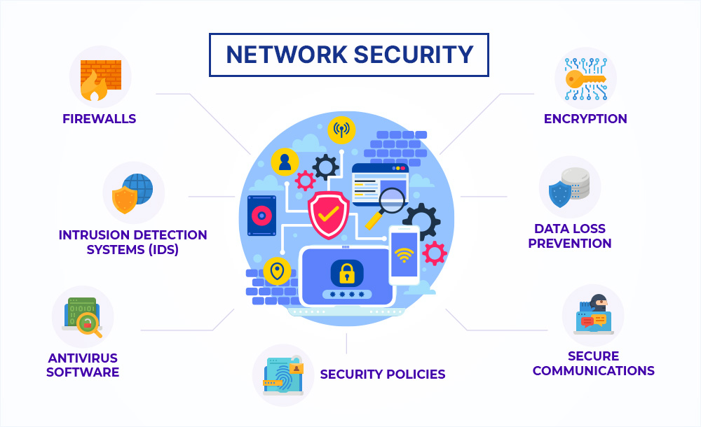

# Introduction to Networks

Have you ever wondered how you can talk to your friends online, play games with people far away, or watch videos from all over the world? It’s all because of something called a **network**!

In this lesson, we’ll learn about what networks are, how they work, and why they’re so important.

## The Evolution of Networks

Networks started with slow dial-up, where you used the phone line to connect to the internet. It was slow, and you couldn't use the phone and internet at the same time! Then came broadband, which made things faster with DSL and cable. Now, we use fiber optics, which is super-fast, sending data as light through tiny glass wires. This evolution has made everything we do online much quicker and more reliable.

### Internet Speed Comparison

| **Connection Type** | **Average Speed**       |
|---------------------|-------------------------|
| **Dial-up**         | 56 Kbps (Kilobits per second) |
| **DSL**             | 1-15 Mbps (Megabits per second) |
| **Cable**           | 10-200 Mbps             |
| **Fiber Optic**     | 100-1000 Mbps (1 Gbps)  |


---

## How Networks Connect Us

Networks bring us closer together than ever before, allowing us to communicate, share, and learn with people all around the world!

Think about sending a message or video to someone on the other side of the globe in just seconds. That’s the power of networks!

### Fun Facts About Networks

- **The Internet** is the largest network in the world, connecting over 5 billion devices!
- **Wi-Fi** stands for "Wireless Fidelity" and allows you to connect to a network without any cables.
- **The first message** sent over the ARPANET (the precursor to the internet) in 1969 was just "LO" before the system crashed!
- **Fiber optic cables** can transmit data at nearly the speed of light, allowing super-fast internet connections.
- **There are more than 1.7 billion websites** on the internet, and the number is constantly growing.
- **The first email** was sent by Ray Tomlinson in 1971, and it was just a test message that said "QWERTYUIOP."
- **Over 300 billion emails** are sent every day worldwide—talk about staying connected!
- **The term "Wi-Fi"** doesn’t actually stand for anything. It's just a catchy brand name!
- **The "cloud"** isn't just in the sky—it's a network of servers all over the world that store and manage data online.


## Parts of a Network

- **Hosts**: Every device, like computers, phones, or tablets, on a network is called a host.
- **Servers and Clients**:
    - **Servers** are like big helpers that store and share information with other devices.
    - **Clients** are devices that ask for information, like when you search for a website.
- **Peer-to-Peer Networks**: Sometimes, devices can both share and receive information directly from each other. This is called a peer-to-peer network. It’s simple, but not always the best for big networks.

---

## Networks topology

- **Network Maps**:
    - We use special diagrams called **topologies** to draw and understand networks.
    - These diagrams show how all the devices are connected and how information moves around.
- **Network Media**:
    - This is the “road” that data travels on, like wires or even invisible waves (Wi-Fi and Bluetooth).

### Common Network Topologies
- Discuss different network topologies (e.g., star, mesh, bus, and ring), their advantages, and where they are most commonly used.
- 

| **Topology**    | **Description**                                           | **Pros**                                      | **Cons**                                      |
|-----------------|-----------------------------------------------------------|-----------------------------------------------|-----------------------------------------------|
| **Star**        | All devices connect to a central hub.                      | Easy to manage, adding/removing devices is simple. | Hub failure causes entire network to fail.    |
| **Ring**        | Devices are connected in a circular pattern.               | Data flows in one direction, reducing collisions. | If one device fails, the whole network can be disrupted. |
| **Bus**         | All devices share a single communication line (bus).       | Simple layout, easy to implement.              | If the main cable fails, the whole network goes down. |
| **Mesh**        | Each device is connected to multiple other devices.        | Highly reliable, offers redundancy.            | Complex and expensive to set up.              |

## Types of Networks

Networks come in different shapes and sizes. Here are the main types:

- **LAN (Local Area Network)**: A small network, like in your house or school.

- **WAN (Wide Area Network)**: A big network that covers a large area, like the Internet that connects the whole world.

- **Metropolitan Area Network (MAN):** A MAN is bigger than a LAN but smaller than a WAN, usually covering a city or a large campus. Think of it as a super-sized LAN for an entire town.

- **Personal Area Network (PAN):** PANs are tiny networks, like the one between your smartphone and your Bluetooth earbuds. They cover a very small area, just a few meters.

- **Storage Area Network (SAN):** SANs are specialized networks that connect storage devices, like hard drives, to servers. They’re often used in data centers to handle large amounts of data.


---

## Connecting to the Internet

There are different ways to connect to the Internet:
- **Cable**: Using wires, like the ones that bring electricity to your house.
- **DSL**: A special type of Internet that comes through phone lines.
- **Wireless**: Using invisible waves to connect, like with Wi-Fi or mobile data.

### Fiber Optic Internet

Fiber optic cables work by transmitting data as light pulses through thin strands of glass or plastic fibers. Unlike traditional copper cables, which use electrical signals to send data, fiber optics can transfer information at much higher speeds and over longer distances without losing signal quality.

Fun Fact: One strand of fiber optic cable, thinner than a human hair, can carry thousands of phone calls or internet connections at once!

- 

---

## Network Components

A network isn’t just a bunch of computers thrown together. It has different parts, each with a specific job to do.

### End Devices

These are the devices you use every day—PCs, laptops, smartphones, printers. They are the starting and ending points for data traveling across the network. When you send an email, your computer is the **end device** that starts the process, and your friend's phone is the end device that receives it.


### Intermediary Devices

These devices are like the traffic cops of a network. They make sure your data gets from point A to point B smoothly and securely. Some common intermediary devices include:

- **Routers:** These decide the best path for your data to travel across a network or the internet.
  
- **Switches:** They connect multiple devices within the same network, like all the computers in a LAN, and ensure that data goes where it’s supposed to.

- **Firewalls:** Firewalls are the security guards of the network, keeping unwanted traffic out and protecting your data from hackers.


### Network Media

Network media is the road that data travels on. There are three main types:

- **Copper cables:** These are traditional cables, like Ethernet cables, that use electrical signals to transmit data.
  
- **Fiber optics:** Fiber optic cables use light to send data at incredibly high speeds, making them perfect for long-distance communication.

- **Wireless:** This is the invisible path your data takes when you use Wi-Fi. Instead of cables, data is sent through the air using radio waves.


---

## What Makes a Good Network?

- **Fault Tolerance**: If something breaks, the network can still work because it has backup paths.
- **Scalability**: The network can grow easily by adding more devices.
- **Quality of Service**: The network makes sure important things, like video calls, work smoothly.
- **Security**: Keeping the network safe from bad guys who might want to steal information.

### Redundancy and High Availability
To ensure network availability and prevent downtime, strategies like redundancy and high-availability systems are crucial.
Redundancy involves setting up multiple paths or backups for data to travel, so if one path fails, another can take over without disrupting the network. 
High-availability systems are designed to keep services running even during hardware failures or maintenance, often through the use of failover mechanisms, load balancing, and clustering. These strategies help keep networks reliable, minimizing interruptions and ensuring that users can always stay connected.

Some of the world’s most reliable networks have "five nines" availability, meaning they are up and running 99.999% of the time!.

### Cool New Things in Networks

- **Bring Your Own Device (BYOD)**: People can use their own gadgets, like phones or tablets, at work or school.
- **Online Collaboration**: We can work together with others online using tools like video calls.
- **Cloud Computing**: Storing and accessing data on the Internet, so we can get our files from anywhere.

### The Internet of Things (IoT)
The Internet of Things (IoT) refers to a vast network of connected devices that communicate and exchange data with each other over the internet. These devices range from everyday items like smart thermostats and wearables to more complex systems used in industrial automation. IoT devices collect data through sensors and send it across networks to other devices or centralized systems for processing and action. This connectivity allows for smarter homes, where lights, security systems, and appliances can be controlled remotely, and for advanced industrial automation that improves efficiency and safety.

By 2025, it's estimated that there will be over 75 billion IoT devices connected worldwide, transforming how we live and work!
- 

---

## Staying Safe on the Network

Networks need to be protected from dangers like viruses and hackers.
- **Security Solutions**: Things like firewalls and passwords help keep the network safe.

### Advanced Network Security
To protect networks from sophisticated threats, advanced security measures are essential. 
Intrusion Detection Systems (IDS) monitor network traffic for suspicious activities, alerting administrators to potential security breaches. 
Virtual Private Networks (VPNs) create secure, encrypted connections over the internet, allowing users to access a network remotely without exposing sensitive data. Encryption techniques further secure data by converting it into a code that only authorized parties can decode, protecting information from unauthorized access during transmission.
The first known encryption system was used by Julius Caesar over 2,000 years ago to send secret messages to his generals, a method now known as the "Caesar Cipher"
- 

---

## Becoming an IT Expert

Learning about networks can lead to cool jobs in the future. There are special certifications (like diplomas) you can get, such as CCNA, to show you’re an expert in networking.

---

## Basic Network Protocols and Standards

### What Are Network Protocols?

Think of network protocols as the rules of the road for data. They define how data is packaged, sent, received, and understood. Without these rules, devices wouldn’t know how to communicate with each other.

### Essential Protocols You Should Know

- **TCP/IP:** This is the backbone of the internet. TCP (Transmission Control Protocol) ensures that data is sent reliably, while IP (Internet Protocol) handles the addressing and routing of data packets to make sure they reach the right destination.

- **Ethernet:** Ethernet is the standard protocol for wired networks. It makes sure data flows smoothly over cables, like those in a LAN.


### Standards Organizations

To ensure that networks and devices can communicate globally, we have standards organizations:

- **IEEE (Institute of Electrical and Electronics Engineers):** This group sets the standards for a lot of technologies, including Ethernet.

- **IETF (Internet Engineering Task Force):** The IETF develops and promotes voluntary internet standards, like TCP/IP, that keep the internet running smoothly.

---

## Getting Started with Network Devices; Basic Switch and Device Setup

### What is Cisco IOS?

Cisco IOS is the operating system (OS) for special devices like routers and switches that help connect the internet. Just like your computer has Windows or your phone has iOS or Android, network devices have Cisco IOS.

### Different Types of Network Operating Systems

Network Operating Systems (NOS) manage the hardware and software resources on network devices like routers and switches. Here are a few examples:

- **Juniper's JUNOS**: Known for its stability and modular design, JUNOS is used on Juniper Networks' devices. It's praised for its user-friendly interface and robust security features.

- **HP's ProCurve**: This NOS is used in HP networking products. It offers easy integration with HP hardware and is designed for simplicity in managing network tasks.

- **MikroTik's RouterOS**: Popular for its flexibility and cost-effectiveness, RouterOS is used in MikroTik devices. It provides advanced features like firewalling, VPN, and bandwidth management, making it a favorite among small to medium-sized networks.

### How It Works:

- **The Shell** is like the screen you see when you play a game. It lets you control the device.
- **The Kernel** is like the brain that makes everything work behind the scenes.
- **The Hardware** is the actual device, like the router or switch, with parts like the motherboard and memory inside.

### Understanding Hardware Specifications
When it comes to network devices like routers, switches, and servers, hardware specifications play a crucial role in determining their performance and capability. Key specifications include the CPU, memory, and interface types, each of which impacts how well the device can handle data processing, traffic, and connectivity

The first commercial Ethernet speed was 10 Mbps, but today’s advanced network devices can handle speeds up to 400 Gbps!


---

## Using the Command Line

Cisco devices don’t have a pretty screen with icons like your computer. Instead, you use a special command line, which is like typing in secret codes to make things happen.

### Ways to Access the Command Line:

- **Console Cable**: This is like a special cable you plug in directly to set things up.
- **Secure Shell (SSH)**: This lets you control the device from far away but safely.
- **Telnet**: This also lets you control the device from far away, but it’s not safe, so we don’t really use it anymore.

### Moving Around the Command System

There are two main modes you’ll use:
- **User Exec Mode**: This is the basic mode where you can do simple things. You’ll see a `>` symbol.
- **Privileged Exec Mode**: This mode lets you do more advanced stuff. You’ll see a `#` symbol.
- **Global Configuration Mode**: This is where you can change how the device works. You’ll see a `#` with some extra words next to it, like `Switch(config)#`.

### Typing Commands

When you type commands, you have to be precise. For example, if you want to check if a device is working, you might type:
```
ping 192.168.10.5
```
This tells the device to check if another device at that address is reachable.

### Help and Shortcuts:

- If you forget a command, you can type `?` after a word, and it will show you what you can do next.
- You can also use shortcuts to save time. For example, instead of typing `configure`, you can just type `conf`!

### Using the Keyboard

- **Tab Key**: Helps complete commands if you’ve started typing them.
- **Arrow Keys**: Move the cursor to fix mistakes or repeat commands.
- **Ctrl + C**: Stops what you're doing and takes you back to the main screen.
- **Ctrl + Shift + 6**: This is like the "pause" button. It stops what’s happening if something is taking too long.

---

## Setting Up Your Network Devices; Basic Device Configuration

### Naming Your Devices

Every network device, like a router or switch, needs a special name so you can easily find it. Don’t name your devices “Mickey” or “Goofy”—use names that tell you where they are, like "SW-Floor-1" (Switch on Floor 1).

### Naming Rules:

- The name must start with a letter, not a number.
- It shouldn’t have spaces, but you can use dashes (-).
- The name should be less than 64 characters long.

### Standard Naming Conventions
Standard naming conventions are vital for consistency and easy management in large networks. They help everyone quickly identify devices and their roles, making troubleshooting and maintenance more efficient. For example, naming a switch "TLN-SW1" indicates it's the first switch in Tallinn, making its location and purpose clear.

### Setting Strong Passwords

Passwords keep your devices safe from people who shouldn’t be using them.


---

## Learning About Network Protocols; Understanding Protocols and Models

### Why Do We Need Rules to Communicate?

Just like people need to speak the same language to understand each other, computers need to follow specific rules called **protocols** to communicate.

Imagine if one person spoke English and another spoke French—they wouldn’t understand each other unless they agreed to speak the same language!

### The Basics of Communication

For any communication, you need:
- **A Sender** (the person or device sending the message).
- **A Receiver** (the person or device getting the message).
- **A Medium** (how the message is sent, like through wires or Wi-Fi).

### Data Transmission Methods

Data transmission methods define how data flows between devices. Here’s a quick look at the three main types:

- **Simplex**: Data flows in one direction only. An example is a TV broadcast, where the signal goes from the station to your TV without any return signal.

- **Half-Duplex**: Data flows in both directions, but not at the same time. Think of a walkie-talkie, where one person talks while the other listens.

- **Full-Duplex**: Data flows in both directions simultaneously. This is like a phone call, where both people can talk and listen at the same time.

---

## What are Protocols?

**Protocols** are the rules that devices follow to talk to each other.

They help with:
- **Encoding**: Changing the message into a form that can be sent, like turning words into digital signals.
- **Formatting**: Making sure the message is organized properly so it can be understood.
- **Timing**: Ensuring that messages are sent and received at the right speed.
- **Delivery**: Deciding if the message goes to one device, a group, or everyone.

### Error Detection and Correction
Error detection and correction are key to making sure data is sent accurately across a network. When data travels, it can pick up errors due to interference.
To catch these errors, protocols use methods like checksums or CRC, which help spot problems in the data.

If an error is found, the system can either ask for the data to be sent again or try to fix it automatically using extra information that was sent with the data. These processes keep our communications reliable and accurate.

Error detection methods like Hamming codes have been used since the 1940s and are still important in today’s technology!

### Types of Message Delivery

- **Unicast**: Sending a message from one device to one other device.
- **Multicast**: Sending a message from one device to several devices.
- **Broadcast**: Sending a message to all devices on the network.

### Anycast Communication
- Introduce anycast, where a message is sent to the nearest or best recipient among a group of devices.

### Different Kinds of Protocols

There are many types of protocols, each with its own job:
- **Network Communication Protocols**: Help devices talk over the network.
- **Security Protocols**: Keep data safe by making sure only the right people can see it.
- **Routing Protocols**: Help find the best path for data to travel.
- **Service Discovery Protocols**: Help devices find each other on the network.

### Common Network Protocols

| **Protocol** | **Full Name**                  | **Purpose**                                                                 |
|--------------|--------------------------------|------------------------------------------------------------------------------|
| **HTTP**     | Hypertext Transfer Protocol    | Used for transferring web pages on the internet.                            |
| **FTP**      | File Transfer Protocol         | Used for transferring files between computers.                              |
| **DNS**      | Domain Name System             | Translates domain names into IP addresses.                                   |
| **SMTP**     | Simple Mail Transfer Protocol  | Used for sending emails from one server to another.                         |

**Fun Fact:** The DNS system is often referred to as the "phonebook of the internet" because it matches domain names to their corresponding IP addresses!

### How Protocols Work Together

Many protocols work together to make sure everything runs smoothly.

For example:
- **HTTP**: Helps load web pages.
- **TCP**: Makes sure data gets to where it’s going without errors.
- **IP**: Finds the best route for the data to travel.
- **Ethernet**: Connects devices through cables or Wi-Fi.

### What is a Protocol Suite?

A **Protocol Suite** is a group of protocols that work together to perform communication tasks.

The most common one is **TCP/IP**, which is the backbone of the internet.

### Evolution of TCP/IP
- Discuss the history and evolution of TCP/IP, including its role in the development of the modern internet.

### Sending Data Across the Network

When you send a message, like loading a web page, the data is broken down, packed up, and sent across the network in tiny pieces.

The receiving device then puts it all back together so you can see the web page.

### Who Makes the Rules?

There are many organizations that create and maintain these rules (protocols), making sure everything works together.

Some of these include:
- **IETF**: They make sure the internet works smoothly.
- **ICANN**: They help manage website names and IP addresses.
- **IEEE**: They create standards for electronic devices.

The Internet Engineering Task Force (IETF) is a key organization responsible for developing and maintaining the standards and protocols that make the internet function smoothly. The IETF brings together a global community of engineers, network designers, and researchers who collaborate to create and refine technical standards like HTTP, TCP/IP, and DNS.

The IETF’s work is published in documents called "RFCs" (Request for Comments), which serve as the blueprints for internet technologies!


---

## Understanding Network Layers and Models; Layers and Models

### Why Do We Use Layers?

Networks can be complicated, but layers help us break down the big job of sending data into smaller, easier tasks.

Each layer has a specific job, like baking, frosting, and decorating a cake!

### Advantages of Layered Architectures

Layered architectures in networks are helpful for a few reasons:

- **Modularity**: Imagine if you want to change the cheese in your sandwich. You can do that without touching the bread or meat. In networks, this means you can update one part without messing up the others.

- **Scalability**: Just like you can make a bigger sandwich by adding more layers, networks can grow by adding more layers or parts without changing the whole thing.

- **Ease of Troubleshooting**: If something’s wrong with your sandwich, like a bad piece of lettuce, you can easily find it and fix it. In networks, if there’s a problem, it’s easier to find and fix it in just one layer.

### OSI Model (7 Layers):

1. **Physical**: Sends electrical signals (like turning lights on and off).
2. **Data Link**: Makes sure data is in the right format.
3. **Network**: Decides the best path for data to travel.
4. **Transport**: Makes sure data arrives safely.
5. **Session**: Manages the connection between devices.
6. **Presentation**: Prepares data so the application can use it.
7. **Application**: Interacts directly with the software you use, like web browsers.

### TCP/IP Model (4 Layers):

1. **Network Access**: Combines Physical and Data Link layers (handles hardware).
2. **Internet**: Handles the Network layer’s job (routes data across networks).
3. **Transport**: Same as OSI’s Transport layer.
4. **Application**: Combines the top three OSI layers (for apps and software).

### Comparison Between OSI and TCP/IP Models

| **Aspect**         | **OSI Model**                                  | **TCP/IP Model**                             |
|--------------------|------------------------------------------------|----------------------------------------------|
| **Layers**         | 7 layers                                       | 4 layers                                     |
| **Usage**          | Mainly for teaching and conceptual understanding| Widely used in real-world internet applications |
| **Layer Names**    | Physical, Data Link, Network, Transport, Session, Presentation, Application | Link, Internet, Transport, Application |
| **Adoption**       | Not fully implemented in practice              | Foundation of the internet and most networks |

### Remembering the OSI Model

A fun way to remember the OSI layers is with the phrase: **“Please Do Not Throw Sausage Pizza Away.”** Each word helps you recall the layers in order.

### How Does Data Travel in Layers?

When data is sent across a network, it’s broken down into smaller pieces called segments.

These segments are put together (or multiplexed) with other data to travel faster.

### Data Encapsulation

As data moves down through the layers, each layer adds its own information to it. This is called encapsulation.

When the data reaches its destination, the layers are peeled back, like unwrapping a gift, until the original data is revealed.

### Addressing Data in the Network

Every piece of data needs an address to know where it’s going. There are two main types:
- **IP Address (Layer 3)**: Tells the network where the data should go globally (like a postal address).
- **MAC Address (Layer 2)**: Tells which specific device on a local network should receive the data (like a house number).


### IPv4 vs. IPv6

IPv4 and IPv6 are both versions of the Internet Protocol (IP) used to identify devices on a network, but they have key differences:

| **Aspect**             | **IPv4**                                       | **IPv6**                                                |
|------------------------|------------------------------------------------|---------------------------------------------------------|
| **Address Length**     | 32-bit (e.g., 192.168.1.1)                     | 128-bit (e.g., 2001:0db8:85a3::8a2e:0370:7334)          |
| **Number of Addresses**| ~4.3 billion addresses                         | 340 undecillion addresses (a huge number!)              |
| **Format**             | Dotted decimal format                          | Hexadecimal format with colons                          |
| **Need for IPv6**      | Limited address space, running out of addresses| Vast address space to accommodate the growing number of internet-connected devices |

IPv4’s 4.3 billion addresses seemed plenty in the 1980s, but with the explosion of smartphones, IoT devices, and more, IPv6 was created to handle the massive increase in internet-connected devices!


### What Happens on Different Networks?

When two devices, like your computer and a printer, are on the same local network (like in your home), they talk to each other using their MAC addresses. 
Think of a MAC address like a house number—it helps devices find each other quickly when they're close by.

But when two devices are on different networks (like your computer at home and a server on the internet), things work a bit differently.
They use IP addresses to send data across the internet.
The IP address is like a street address that helps your data find its way to the right network. 
Once it gets to the right network, the data uses the MAC address to find the exact device it needs to reach.


